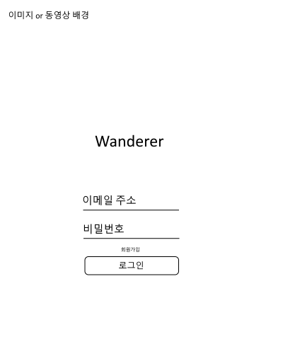
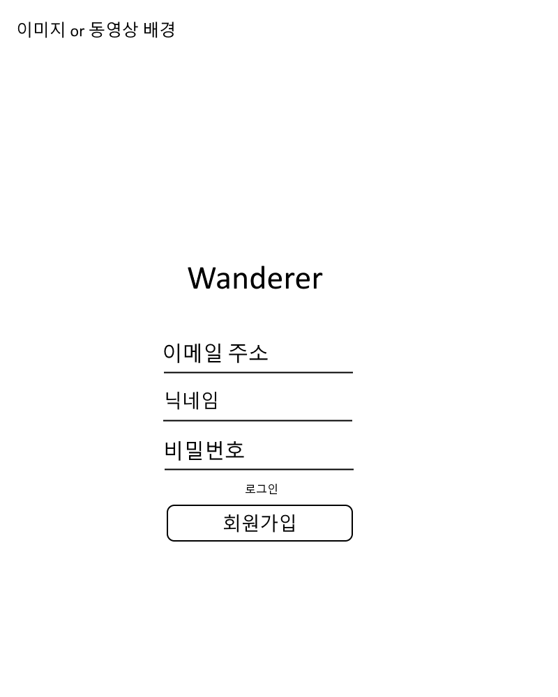
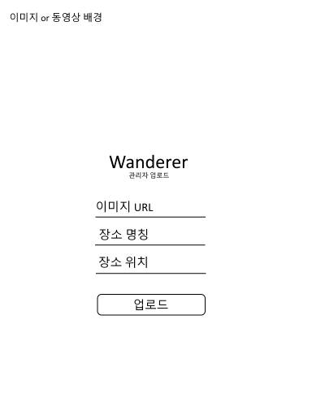
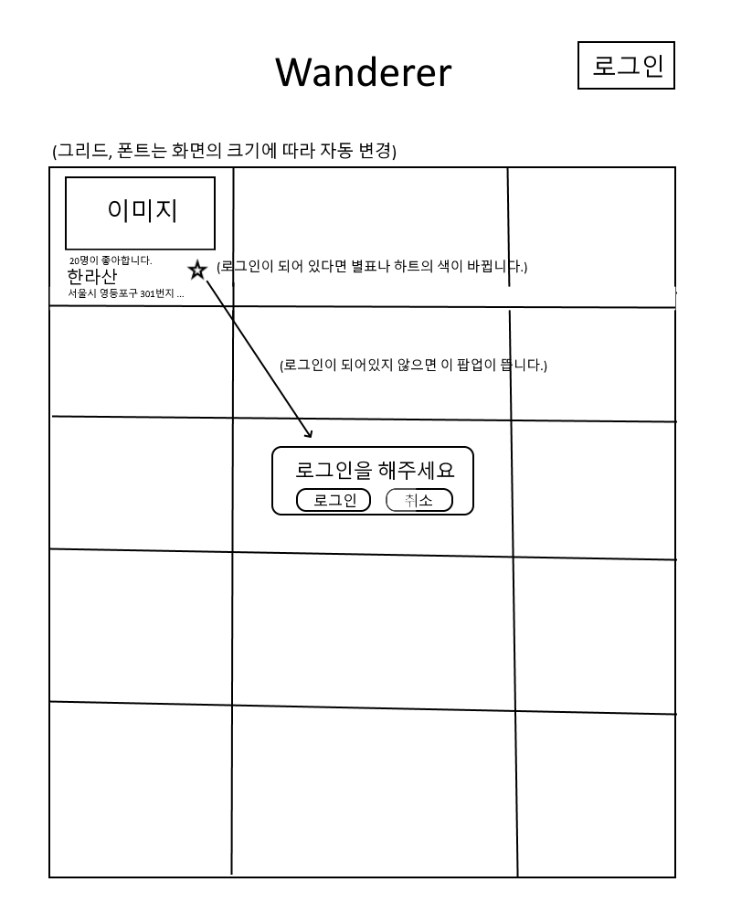

# wanderer
윤송입니다~
* ## Project
    * <details>
      <summary>설명</summary>
      <br>

      간단한 여행지 좋아요 사이트입니다.   
      정해진 여행지 목록에서 좋아요를 누르고   
      다른 사람들은 얼마나 좋아하는지 알아볼 수 있습니다.   
      
      
      </details>
      <br>

* ## Frontend
    * <details>
      <summary>Wireframe</summary>
      <br>

      로그인 페이지   

      

      회원가입 페이지   

      

      업로드 페이지   

      

      메인 페이지   

      
      </details>
      <br>
    


* ## Backend
    * <details>
      <summary>API 설계</summary>
        <br>

        * /login   
            * method = post
            * request = {email="", password=""}
            * response = {res=True, msg="로그인 되었습니다.", val=JWT}
            * 기능 = 비밀번호, 이메일 확인, 로그인

        * /logout
            * method = post
            * jwt를 연구하고 구현 or 프런트에서 해결
            * 기능 = 로그아웃

        * /signup
            * method = post
            * request = {email="", password="", nickname=""}

            * response = {res=True, msg="회원가입 되었습니다.", val=JWT}
            * 기능 = 이메일/닉네임 중복확인, 회원가입

        * /placelist
            * method = get
            * request = {jwt=JWT}
            * response = {res=True, msg="", val=[{imgsrc="url", likeCount=3, liked=True, placeName="한라산", location="서울시 영등포구 ..."},{...},{...}]}
            * 기능 = front에 모든 장소를 표기, array val로 받음

        * /upload
            * method = post
            * request = {imgsrc="", placeName = "", loaction = ""}
            * response = {res=True, msg="", val=""}
            * 기능 = 장소를 업로드한다.

        * /like
            * method = post
            * request = {placeName="한라산", jwt=JWT}
            * response = {res=True, msg="좋아요가 완료되었습니다." val=""}
            * 기능 = place 데이터베이스에 해당 이메일이 존재한다면 like를 하고 존재하지 않는다면 unlike를 한다. 로그인된 아이디로 장소를 좋아요/좋아요 취소 한다.

    </details>

    * <details>
      <summary>기능적 요구</summary>
      <br>

      * 여행지 데이터 직접 입력 or scraping   

      * Jinja2에 대한 연구    

        jinja2는 flask에서 html에 변수를 보내주어 사용할 수 있는 plugin입니다.   
        <br>

        파이선 서버에서 변수 보내주기 
        ```python
        return render_template("index.html", var = giveVar)
        ```
        <br>

        html 변수표시는 `{var}` 코드는 `{{code}}`로 한다.   
        <br>

        html if 문
        ```html
        
        <p>{{ template_variable }}, World!</p> 
        
        ```
        <br>

        html if, else if, else 문
        ```html
        
        <p>{{ template_variable }}은 20보다 작다.</p> 
        
        <p>{{ template_variable }}은 20보다 크다.</p> 
        
        <p>{{ template_variable }}은 20이다.</p> 
        
        ```
        <br>

        html for 문
        ```
        
        
        
        <li>{{ gu_name }}: {{ gu_mise }}</li>
        
        ```
        <br>

        dictionary for 문
        ```
        <ul>
        
        <li>{{ key }} : {{ value }}</li>
        
        </ul>
        ```
        <br>


      * [JWT에 대한 연구](https://www.youtube.com/watch?v=e-_tsR0hVLQ&t=130s)   

      * [responsive grid에 대한 연구](https://codepen.io/astrotim/pen/WQwqbW)

      </details>
      <br>

 
* ## 협업
    * <details>
      <summary>git</summary>
      <br>

      깃헙에는 branch 라는 개념이 있습니다.   
      각자 수정하신 내용을 따로 commit(업로드) 하는 곳이 branch 입니다.   
      Branch 를 원래 master branch에 업로드 하고 싶으시다면   
      pull request를 해야 합니다.   

      branch 생성하기
      ```
      git checkout -b 브랜치명
      ```

      branch 이동하기
      ```
      git checkout 브랜치명
      ```

      자신의 branch 에 커밋하기
      ```
      git add .
      git commit -m "html 그리드를 수정"
      git push origin 브린치명
      ```
      
      자신의 branch를 master에 병합 요청하기 (pull request)   
      저희 project repository 웹사이트에서   
      본인의 branch로 들어가신 다음   
      Pull request 버튼을 눌러주세요.    
      마지막으로 제목과 메시지를 넣어주시고   
      create pull request를 눌러주시면 됩니다.   
    
      
      </details>


<br>
<br>

드랍다운 예시
```
<br>
<details>
<summary>드랍다운</summary>
<br>

드랍다운 내용
</details>
<br>
```